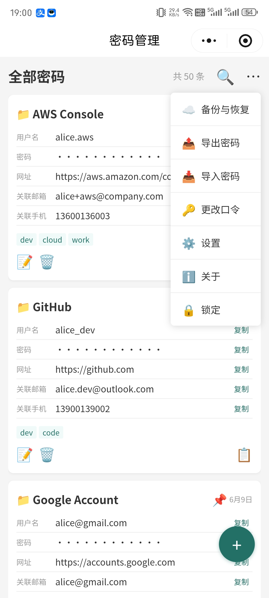
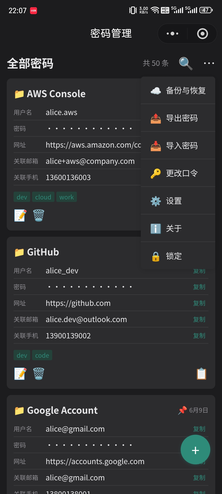
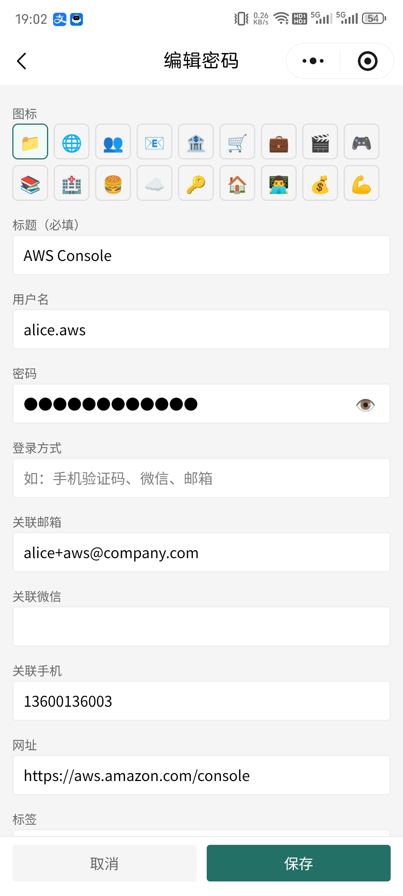
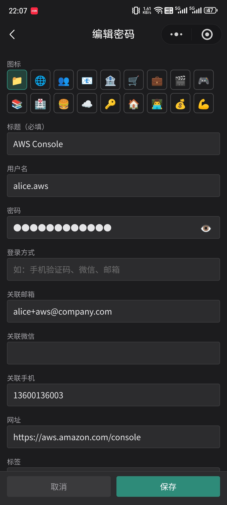
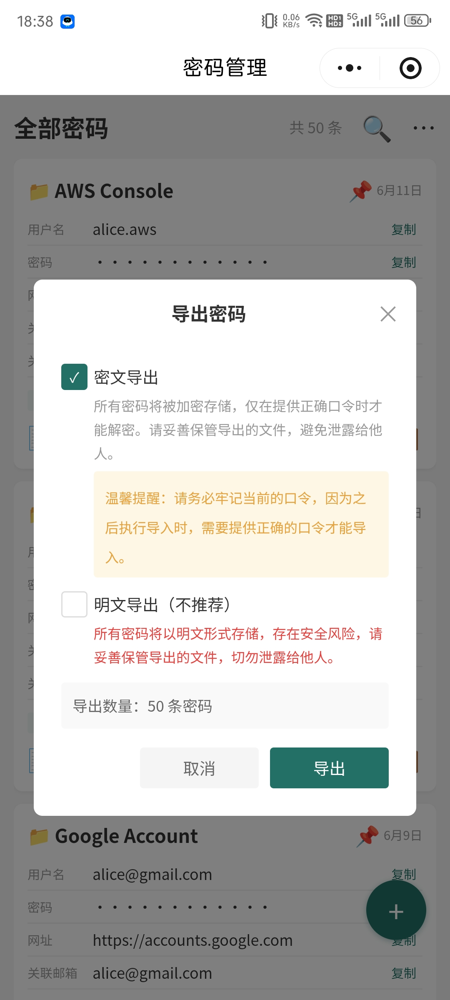
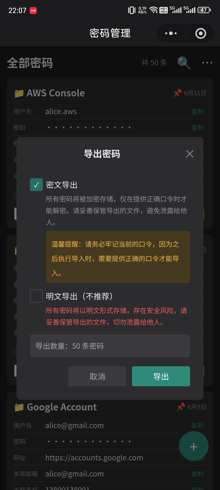
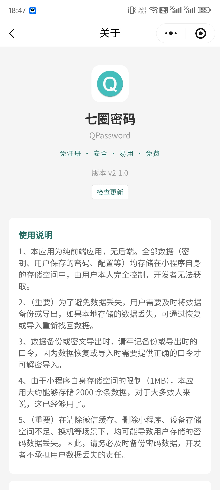
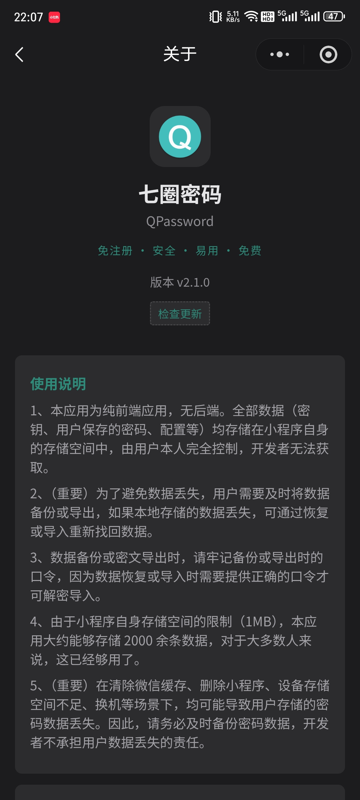

# QPassword（七圈密码）


> 一个简单、易用、免注册、无后端的安全密码本工具。

QPassword 帮助你在设备本地记录、查询和管理各类账号密码，所有数据经 **AES-256-GCM** 加密后仅保存在你自己的设备上，**无后端服务**，开发者不会获取也无法获取你的任何数据。

支持平台：**微信小程序** 与 **React Native（仅测试了 Android）**。

**欢迎扫码体验**（打开微信扫一扫）

<p align="center">
  
</p>

## 功能

### 记录密码

- 支持记录：标题、用户名、密码、登录方式、邮箱、手机号、微信、网址、标签、备注等字段
- 支持置顶密码，方便快速访问
- 支持新增、修改、删除密码，各字段支持一键复制

### 检索密码

- 关键字模糊检索：包括标题、用户名、登录方式、邮箱、手机号、微信、网址、标签、备注
- 支持按标签检索
- 保留最近检索历史，方便再次查找

### 口令保护

- 进入应用需输入口令，支持 **文字口令** 与 **图案口令**
- 可随时更改口令
- 口令本身不存储，仅用于派生口令密钥（详见[数据安全性](#数据安全性)）

### 导出 / 导入

- 导出为单文件 `.qp2`，支持**密文模式**（加密导出）与**明文模式**（自行保证存储安全）
- 支持导入本地密码文件，自动对比 `id` 相同的记录：内容不同则覆盖、相同则跳过
- 密文导入时需提供导出时的口令才能解密

### 备份 / 恢复（WebDAV）

- 通过 WebDAV 协议备份到云盘或 NAS，备份文件同样加密
- 支持从 WebDAV 恢复数据，自动合并（更新 / 新增）
- 云端备份配置（服务器地址、账号、密码）加密存储于本地

### 个性化

- 支持深色 / 浅色 / 跟随系统三种主题（微信端）

## 运行截图

| 说明 | 浅色主题 | 深色主题 | 
| :---: | :---: | :---: |
| 密码列表 |  |  |
| 密码编辑 |   |   |
| 导出(备份) |  |  |
| 关于 | | |

## 数据安全性

### 关键概念

| 名称 | 长度 | 生成方式 | 用途 |
| --- | --- | --- | --- |
| 口令 Passcode | ≥4 字节 | 用户输入 | 派生口令密钥 |
| 随机盐 Salt | 32 字节 | 安全随机数 | 提高口令密钥安全性 |
| 口令密钥 Passcode Key | 32 字节 | PBKDF2-HMAC-SHA256（口令 + 随机盐，200,000 次迭代） | 加解密数据密钥 |
| 数据密钥 Data Key | 32 字节 | 安全随机数 | 加解密用户密码数据 |
| 加密的数据密钥 | — | 数据密钥用口令密钥 AES-256-GCM 加密 | 保护数据密钥、校验口令 |

### 加密逻辑

- 用户首次设置口令时，应用生成随机盐，通过 **PBKDF2-HMAC-SHA256**（迭代 20,000 次、输出 256 位）派生口令密钥，并用它加密随机生成的数据密钥，加密后的数据密钥持久化保存。
- 用户密码数据全部使用**数据密钥**以 **AES-256-GCM** 加密存储；每次加密使用**随机生成的 12 字节 nonce**，即使相同数据，密文也完全不同。
- 下次进入时，输入口令派生口令密钥并解密数据密钥：成功则口令正确，失败则提示重新输入。
- 更改口令时只需生成新盐与新口令密钥，重新加密数据密钥即可，**用户数据无需重新加密**。

### 安全承诺

- **口令不存储**：口令仅用于派生密钥，明文口令不会落盘。
- **数据密钥仅存在于内存**：不持久化，解锁后短暂驻留于内存供加解密使用。
- **无后端**：所有数据（含密文、配置）仅保存在本地；WebDAV 备份服务器也是由用户自行指定的，数据直传，无中转。

## 技术栈

- 框架：[Taro 4.x](https://docs.taro.zone/)（多端统一开发）
- UI：React + TypeScript，函数组件风格
- 加密和密钥派生算法：AES-256-GCM、PBKDF2-HMAC-SHA256（[noble-ciphers](https://github.com/paulmillr/noble-ciphers) / [noble-hashes](https://github.com/paulmillr/noble-hashes)）
- 跨端：微信小程序（weapp）、React Native（RN）

## 本地开发

```bash
npm install

# 微信小程序
npm run dev:weapp

# React Native（Android）
npm run start
npm run android
```

## License

[Apache License 2.0](./LICENSE)

